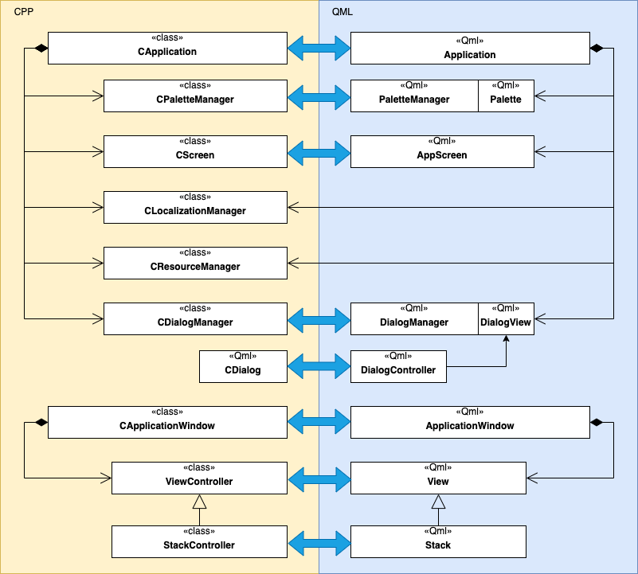

# CoreQML


QtQuick brings to the developers a powerful tool to truly separate application logic and UI. However, if used solely without QtQuick.Controls module (which is a usual case for embedded platforms), lacks useful classes for writing a maintainable MVC application, which often includes interaction between Qml/C++ classes, navigation between views, status bar, dialogs, splash screen, localization management, and palettes/style management. CoreQML provides clear and agile classes/components for GUI applications, automatic bindings between C++ and QML code, and creates a useful abstraction level for basic MVC applications.

This is not a UI framework, but it is a set of architecture solutions that you can use to start implementing a useful QtQuick app in the shortest possible terms.

> The code is pure QtQuick and does not have dependencies on Qt Quick Controls. This is done to make it compatible with embedded systems, like EGLFS with a single window.


## Quick Start


**CoreQML** code is located in the **coreqml** folder. This code can be fully or partly reused in your app. To start your own application, just copy it into your development tree. It does not have external dependencies, besides Qt.

You will need to subclass **CApplication** to implement it's **run()** method, which is the entry point of the application. In this method you will create a **CApplicationWindow** instance, which servers as a GUI container for your custom **Views**.

More info on system design and components can be found below.

Use the sources in the **example** folder as reference. It is not a part of **CoreQML**.


## Overview


The **CoreQML** Model-View-Controller idea is inspired by the old versions of UIKit.

The central pieces of the library are Qml **View** component bonded with C++ **ViewController**. **View** is the Qml **Item** providing a container for the single application view (screen). **ViewController** is a C++ class providing a C++ backend for the **View**. **CoreQML** manages bindings between your custom **Views** and **ViewControllers**.  Any of **Q_PROPERTY** or **SIGNAL/SLOT** you will create in your **ViewController** subclass will be available **automatically** to your custom **View** without writing any additional placeholder code.

For simple forward-backward navigation between views, **CoreQML** provides the Qml **Stack** and C++ **StackController**. CoreQML **Stack/StackController is a View/ViewController** subclass, that manages stack of **Views**. Navigation can be done both from C++ and QML side, whatever you will find more suitable in your situation.

C++ **CDialogManager**, **CDialog** and Qml **DialogManager**, **Dialog** and **DialogController** provides agile API to show modal dialogs. Dialogs can be shown both from C++ and from Qml side, whatever you will find more suitable in your situation.

C++ **CApplicationWindow** (**QQuickView** subclass) and Qml **ApplicationWindow** are the entry points of the GUI part of the applicatoin. These components creates a UI window for your application and allows you to put your **Views** on it. 

C++ **CApplication** and Qml **Application** serves as an entry point of the application and provides access to other subsystems.

C++ **CScreen** and Qml **AppScreen** used to (*dynamically!*) calculate UI components sizes based on display DPI, size and user preferences.

C++ **CPaletteManager** and Qml **PaletteManager** and **Palette** are the core components for switching UI theme at runtime.

C++ **CLocalizationManager** and C++ **CResourceManager** are utility classes for changing UI language and handling app resources.

An image below shows relation between above components. Blue bidirectional arrow shows that Qml object has a link to corresponding C++ object, can subscibe to it's signal, call slots or access it's properties




## Components


### CApplication and CApplicationWindow

CoreQML **CApplication** is a base class that handles the application lifecycle, processes command-line parameters and provides access to application-wide interfaces. 

It is an entry point of the application.

```cpp
// main.cpp

#include "Application.h" // subclass of CApplication

int main( int argc, char* argv[] )
{
    Application app( argc, argv );
    return app.run();
}
```

User should subclass **CApplication** and override it's *CApplication::run()* method. You can also parse command-line arguments in Application constructor.

Below is a basic implementation, that creates an **CApplicationWindow** and populates it with the root application [ViewContoller](#views-and-navigation)

```cpp
// Application.cpp

int Application::run()
{
    CApplicationWindow window;

    auto* viewCtrl = new ViewController( QUrl{ "qrc:/QML/CatsView.qml" });
    window.setRootViewController( viewCtrl );
    window.show();

    // start main application run loop
    return CApplication::run();
}
```

**CoreQML** **CApplicationWindow** is a *QQuickView* subclass. It extends *QQuickView* functionality by attaching an **ApplicationWindow** Qml component and providing API for displaying user **Views**. You can also subclass **CoreQML** **ApplicationWindow** to register own application [palettes and styles.](#palette-and-styling)

### Views and Navigation

Qml **View** represents a single screen of your application. Each **View** is automatically attached to C++ **ViewController** instance. 

User can extend **View** to create it is own interface. Below is a simple **View**, that displays cat image.

```qml
// CatsView.qml

import QtQuick 2.0
import CoreQML 1.0

View {
    // displays random cat
    Image {
        anchors.fill: parent
        source: "https://cats.com/random_cat.png"
    }
}
```

**CoreQML** implicitly or explicitly assigns a C++ **ViewController** instance to each **View**. For the root **View**, user need to specify **ViewController** explicitly:

```cpp
// Application.cpp

...
ApplicationWindow window;

// set the first user view and view controller visible
auto* viewCtrl = new ViewController( QUrl{ "qrc:/QML/CatsView.qml" });
window.setRootViewController( viewCtrl );
...
```

Pure **ViewController** does not add much value to your app. Usually you need it to do some business logic and provide some data to your **View**. Let's do a **ViewController**, that provides cat images to the **CatsView** above.

```cpp
// CatsViewController.h
#ifndef CATS_VIEW_CONTROLLER_H
#define CATS_VIEW_CONTROLLER_H

#include <coreqml/ViewController.h>

class CatsViewController : public ViewController
{
    Q_OBJECT
    Q_PROPERTY( QUrl catImage READ catImage NOTIFY catImageChanged )
public:
    CatsViewController( QObject* parent = nullptr )
        : ViewController( QUrl{ "qrc:/QML/CatsView.qml" }, parent ){}

    QUrl catImage() const {
        return m_CatImage;
    }

public Q_SLOTS:
    void nextCat() {
        // get next cat image from cats database
        m_CatImage = CatsDatabase::getRandomCat();
        Q_EMIT catImageChanged();
    }

Q_SIGNALS:
    void catImageChanged();

private:
    QUrl m_CatImage;
};

#endif // CATS_VIEW_CONTROLLER_H


// Application.cpp
int Application::run()
{
    CApplicationWindow window;
    // set CatsViewController as application root ViewController
    window.setRootViewController( new CatsViewController );
    window.show();

    // start main application run loop
    return CApplication::run();
}
```

```qml
// CatsView.qml

import QtQuick 2.0
import CoreQML 1.0

View {
    // 'viewController' property of the View stores a reference to assigned
    // C++ ViewController instance.
    Image {
        anchors.fill: parent
        // get image from controller
        source: viewController.catImage
    }
    MouseArea {
        anchors.fill: parent
        // retrieves next cat picture
        onClicked: { viewController.nextCat() }
    }
}
```

Now we have a small and shiny single **View** application. However, for many real cases, we need to have more **Views** and functionality to switch between them.

Let's add an AboutView.qml to the app. We will not create a custom **ViewController** instance for this **View**, so it will use implicitly created **ViewController**.

```qml
// AboutView.qml

import QtQuick 2.0
import CoreQML 1.0

View {
    Rectangle {
        id: background
        anchors.fill: parent
        color: "white"
    }
    Text {
        anchors.centerIn: parent
        text: "Copyright: yes"
    }
}
```

Forward-backward navigation is provided by **Stack**/**StackController** components. Let's change our *Application::run()* method adding this component to the app.

```cpp
// Application.cpp

int Application::run()
{
    CApplicationWindow window;
    
    // create a StackController with a CatsViewController as a top view
    auto* stackCtrl = new StackController( new CatsViewController );
    window.setRootViewController( stackCtrl );
    window.show();

    // start main application run loop
    return CApplication::run();
}
```

Now each **View**/**ViewController** has reference to **Stack**/**StackController** to initiate navigation. Navigation can be done either from C++ or from Qml side. 


Qml side navigation (notice different options):

```qml
// CatsView.qml

import QtQuick 2.0
import CoreQML 1.0

View {
    // 'viewController' property of the View stores a reference to assigned
    // C++ ViewController instance.
    Image {
        anchors.fill: parent
        // get image from controller
        source: viewController.catImage
    }
    MouseArea {
        anchors.fill: parent
        // retrieves next cat picture
        onClicked: { viewController.nextCat() }
        onLongClicked: {
            // Option 1: Pushes AboutView on top and makes it active View
            stack.pushView( { source: "qrc:/QML/AboutView.qml" } )

            // Option 2: Pass also additional parameters
            // stack.pushView( { 
            //      source: "qrc:/QML/AboutView.qml", 
            //      lastImage: viewController.catImage } )
            //} )

            // Option 3: Create and push View attached to the 
            // custom C++ CustomViewController
            // CustomViewController needs to be registered in 
            // ViewControllersFactory
            // stack.pushView( { 
            //      class: "CustomViewController", 
            //      customParameter: "Hello!" } )
            //} )
        }
    }
}

// AboutView.qml

import QtQuick 2.0
import CoreQML 1.0

View {
    // Passed parameters are stored in viewController.params
    property url lastShownImage: viewController.params.lastImage

    Rectangle {
        id: background
        anchors.fill: parent
        color: "white"
    }
    Text {
        anchors.centerIn: parent
        text: "Copyright: yes"
    }
    MouseArea {
        anchors.fill: parent
        // returns to previous view
        onClicked: { stack.popView() }
    }
}
```

C++ side navigation:

```cpp
// CatsViewController.h

class CatsViewController : public ViewController
{
    ...
public Q_SLOTS:
    void openAboutPage() {
        stackController()->pushView(
            new ViewController( "qrc:/QML/AboutView.qml" );
        )
    }

    void closeAllViews() {
        // Pops all views to the root view of the StackController
        stackController()->popToRootView()
    }
    ...
};
```


### Modal Dialogs

Showing a modal popups is another crucial feature of any UI application. **CoreQML** provides a easy way of doing so from Qml or C++ side.

Let's create our own modal **DialogView** with a single "Ok" button.

```qml
// OkDialog.qml

import QtQuick 2.1
import CoreQML 1.0

DialogView {
    id: root
    
    // controller is optional attached type
    property var buttonText: controller ? controller.text : ""

    Rectangle {
        id: background

        anchors.centerIn: parent
        width: 300
        height: 200

        MouseArea {
            // consume mouse events inside background
            anchors.fill: parent
        }

        Button {
            anchors.centerIn: parent

            title: root.buttonText
            onClicked: {
                // On click, finish dialog with a positive code
                root.finished( Dialog.Succeeded )
            }
        }
    }
}
```

Whenever, user will click on button, dialog will be closed with *Succeeded* code, if user will click outside, the dialog will be closed with *Rejected* code.

Here is how we can show and handle dialog result from the Qml side

```qml
// CatsView.qml

View {
    ...

    MouseArea {
        anchors.fill: parent
        // If confirmed, retrieves the next cat picture
        onClicked: {
            var dialog = App.dialogManager.showDialog( 
                                 "qrc:/QML/OkDialog.qml",
                                 { buttonText: "Click to see next cat" }
                             )
            dialog.finished.connect( function( code ) {
                if ( code === Dialog.Succeeded ) {
                    viewController.nextCat()
                }
            } )
        }
    }
    ...
}
```

**DialogController** Qml component allows to use cleaner declarative style

```qml
// CatsView.qml

View {
    ...

    DialogController {
        id: confirmationDlg
        property var buttonText: "Click to see next cat"
        source: "qrc:/QML/OkDialog.qml"
        onFinished: => code {
            if ( code === Dialog.Succeeded ) {
                viewController.nextCat()
            }
        }
    }

    MouseArea {
        anchors.fill: parent
        // If confirmed, retrieves the next cat picture
        onClicked: {
            confirmationDlg.show()
        }
    }
    ...
}
```

Other option is to call a modal dialog from the C++ code.

```cpp
// CatsViewController.h

...
public Q_SLOTS:
    void nextCat() {
        auto* pDialog = new CDialog( QUrl( "qrc:/QML/OkDialog.qml" ), this );
        connect( pDialog, &CDialog::finished, this, [ = ]( int result ) {
            if ( result == CDialog::Succeeded ) {
                // get next cat image from cats database
                m_CatImage = CatsDatabase::getRandomCat();
                Q_EMIT catImageChanged();
            }
            // delete dialog after processing
            pDialog->deleteLater();
        } );
        pDialog->show();
    }
...
```

### Palette and styling

**Styling** allows keeping some UI-related constants, like component sizes, margins, fonts, etc in one place. This allows to simplify management of app look and feel during product lifecycle.

**Palette** allows you to have a multiple color palettes for you app and switching then dynamically. 

You need to register your style and palette files to start using them. I recommend you to do this in your custom ApplicationWindow.qml

```qml
// CatsApplicationWindow.qml

import QtQuick 2.0
import CoreQML 1.0

ApplicationWindow {
    id: root

    readonly property int cPaletteLight: 0
    readonly property int cPaletteDark: 1

    Component.onCompleted: {
        // register app style
        App.styleObjectURL = "qrc:/QML/CatsAppStyle.qml"

        // register palette files
        App.paletteManager.registerPaletteFile("qrc:/QML/PaletteLight.qml",
                                               cPaletteLight)
        App.paletteManager.registerPaletteFile("qrc:/QML/PaletteDark.qml",
                                               cPaletteDark)
        // select a dark palette
        App.paletteManager.resetPalette(cPaletteDark)
    }
}

```

Here are some example of style and palette files and how then can be used in CatsView.qml

```qml
// CatsAppStyle.qml

import QtQuick 2.0
import CoreQML 1.0

CoreStyle {
    id: root

    // Generic app button style
    property var button: QtObject {
        property size defaultSize: Qt.size(App.screen.sp(80),
                                           App.screen.sp(44))
        property real fontSize: App.screen.fp(12)
        property real textMargins: App.screen.isp(2)
    }

    // OkDialog
    property var okDialog: QtObject {
        property size defaultSize: Qt.size(App.screen.sp(300),
                                           App.screen.sp(200))
    }

    // AboutView
    property var aboutView: QtObject {
        property real fontSize: App.screen.fp(24)
    }
}

// PaletteLight.qml

import QtQuick 2.0
import CoreQML 1.0

Palette {
    id: root

    // Basic colors
    property color primaryColor: "#51557E"
    property color secondaryColor: "#816797"
    property color primaryTextColor: "black"

    // generic button palette
    property var button: ButtonPalette {
        normal {
            borderColor: "transparent"
            backgroundColor: "white"
            textColor: root.primaryTextColor
        }
        pressed {
            borderColor: "black"
            backgroundColor: "white"
            textColor: root.primaryTextColor
        }
    }

    // OkDialog
    property var okDialog: QtObject {
        property color backgroundColor: secondaryColor
        property url buttonIcon: "qrc:/res/ok_icn.svg"
    }

    // AboutView
    property var aboutView: QtObject {
        property color backgroundColor: primaryColor
        property color textColor: primaryTextColor
    }
}

// AboutView.qml

View {
    ...
    readonly property var cAboutPalette: App.paletteManager.palette.aboutView

    Rectangle {
        id: background
        anchors.fill: parent
        color: cAboutPalette.backgroundColor
    }
    Text {
        anchors.centerIn: parent
        text: "Copyright: yes"
        font.pixelSize: App.style.aboutView.fontSize
        color: cAboutPalette.textColor
    }
    ...
}

// OkDialog.qml

DialogView {
    id: root
    
    // just shorcuts
    readonly property var cOkPalette: App.paletteManager.palette.okDialog
    readonly property var cOkStyle: App.style.okDialog

    Rectangle {
        id: background

        anchors.centerIn: parent
        width: cOkStyle.defaultSize.width
        height: cOkStyle.defaultSize.height
        color: cOkPalette.backgroundColor

        Button {
            anchors.centerIn: parent

            paletteSelector {
                paletteObject: App.paletteManager.palette.button
                icon: cOkPalette.buttonIcon
            }
        }
    }
}
```

Notice the *paletteSelector* property. It references to the **ButtonPaletteSelector** Qml component. This component handles palette for different button states (*normal, pressed, disabled*). Button palette for every state need to be specified in your **Palette** file. Icon is selected automatically using base icon path, e.g if base icon path is **btn_icon.svg**, than **ButtonPaletteSelector** will search for **btn_icon_pressed.svg** icon for *pressed* state and **btn_icon_disabled.svg** for *disabled* state.

### Different screen sizes and DPIs

If you app is going to run on screens with different sizes or pixel density, you should consider a better solution for calculating sizes for UI elements.

Naive solution may be to use a logical points (screen density-aware pixels) whenever possible. However:

- Qml Item does not provide an API for this.

- Logical points does not provide functionality to change size of UI controls dynamically. It is a useful feature to allow user to adjust sizes of their UI controls.

- Density-aware points does not work well when you going to run your software both on mobile and TV screens. E.g, consider we are going to render a 44x44 points button on 160 dpi mobile screen and 40 inches FullHD TV screen. Visual size will be 7x7 mm on mobile and 20x20 mm on TV. For sure, 20x20mm will be too small for the TV. 

You may find, that the problem with the last point, is that a distance between viewer and a screen is not considered in the density-aware solution. **CoreQML** provides a **smart point**, where both screen density (DPI) and user preferred multiplier is taken into consideration.

One **smart point** is equal to one pixel on 160 DPI screen with no custom user multiplier.

Here is an example how it works

```cpp
// Application.cpp

int Application::run()
{
    // CApplication::screen() returns a pointer to CScreen instance
    auto* pScreen = screen();

    // Assume thereis a PlatfromInfo: a fake type, that returns 
    // some parameters for current platform
    double smartPointMultiplier = 1.;
    if ( PlatformInfo::screenType() == PlatformInfo::TVScreen ) {
        // for TV screen, we need twice large smart point
        smartPointMultiplier = 2.;
    }
    // Also, consider user settings
    smartPointMultiplier *= m_Settings.value( "app/userMultiploer", 1. )
                                      .toDouble();

    pScreen->setUISizeMultiplier( smartPointMultiplier );

    // Some embedded platforms are not able to provide a DPI information
    // to Qt system, we can set this manually
    if ( PlatformInfo::doesNotProvideValidDPI() ) {
        pScreen->setDpi( PlatformInfo::dpi() );
        pScreen->setDpiX( PlatformInfo::dpiX() );
        pScreen->setDpiY( PlatformInfo::dpiY() );
    }

    CApplicationWindow window;

    auto* viewCtrl = new ViewController( QUrl{ "qrc:/QML/CatsView.qml" });
    window.setRootViewController( viewCtrl );
    window.show();

    // start main application run loop
    return CApplication::run();
}

```

```qml
// SomeView.qml

import QtQuick 2.0
import CoreQML 1.0

View {
    Rectangle {
        width: parent.width
        // sp(44) corresponds to 44 pixels on 160 DPI 
        // screen with user multiplier set to 1.
        // isp() is sp() rounded to nearest integer
        height: App.screen.isp(44)

        Text {
            // fp() is sp() that also considered user set multiplier
            // for the font size. Sometimes, it is usefull to set it to 
            // some smaller value for the "verbose" (long-word) languages.
            font.pixelSize: App.screen.fp(12)
        }
    }
}
```


